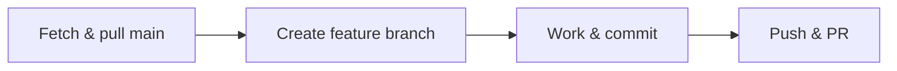

# Git for Noobs

A no-nonsense survival guide for daily Git — all via VS Code, with terminal fallbacks when you need 'em.

---

- [1. Install Git](#1-install-git)
- [2. Link your GitHub account](#2-link-your-github-account)
- [3. VS Code Git Panel (quick tour)](#3-vs-code-git-panel-quick-tour)
- [4. One-time VS Code settings](#4-one-time-vs-code-settings)
- [5. 🚀 The Daily Workflow](#5--the-daily-workflow)
- [6. 🧹 Weekly local branch cleanup](#6--weekly-local-branch-cleanup)
- [7. 📦 Stashing](#7--stashing)
- [8. 🌿 Branching Rules](#8--branching-rules)
- [9. 🔄 Keeping your feature branch updated](#9--keeping-your-feature-branch-updated)
- [10. ⚠️ Common Problems & Fixes](#10-common-problems--fixes)
- [11. 📋 PR Checklist (before tagging me)](#11--pr-checklist-before-tagging-me)

---

## 1. Install Git

1. Download from [git-scm.com/download/win](https://git-scm.com/download/win)
2. Run the installer — **accept all defaults**, every screen
3. Open **VS Code** → `Ctrl+Shift+P` → type `Shell` → select **"Terminal: Create New Terminal"**
4. Verify it's installed:

```bash
git --version
# → git version 2.4x.x.windows.1
```

> If `git` isn't recognised: restart VS Code. If still no: restart your machine. Git adds itself to PATH during install.

---

## 2. Link your GitHub account

VS Code handles this automatically the first time you try to push.

1. `Ctrl+Shift+P` → **"Git: Push"**
2. A dialog pops up: _"Sign in to GitHub"_ → click **Allow**
3. Your browser opens → sign in → authorize VS Code
4. Done. You'll never need to do this again.

**Optional — set your name and email** (so commits show your face, not "unknown"):

```bash
git config --global user.name "Your Name"
git config --global user.email "your@email.com"
```

Run this in the VS Code terminal once. Use the same email you use on GitHub.

---

## 3. VS Code Git Panel (quick tour)

| Action                    | How                                                                            |
| ------------------------- | ------------------------------------------------------------------------------ |
| Open Source Control panel | `Ctrl+Shift+G` or click the branch icon in the left sidebar                    |
| See what changed          | Files under **Changes** = unstaged. Under **Staged Changes** = ready to commit |
| Stage a file              | Hover the file → click **+**                                                   |
| Stage everything          | Three-dot menu `...` → **Stage All Changes**                                   |
| Unstage                   | Hover → click **−**                                                            |
| See the diff              | Click a file under Changes (opens side-by-side diff)                           |
| Commit                    | Type a message in the box at the top → `Ctrl+Enter` or click **✓ Commit**      |
| Discard changes           | Hover → click the **↩️** icon (or three-dot → **Discard Changes**)             |
| Three-dot menu (`...`)    | Pull, Push, Branch, Stash, Fetch, Undo Last Commit — everything lives here     |

---

## 4. One-time VS Code settings

Add these to your `settings.json` for auto-cleanup and less thinking:

1. `Ctrl+Shift+P` → **"Preferences: Open User Settings (JSON)"**
2. Paste these at the top (before the first `{` is fine, or after the first `{`, on a new line):

```jsonc
{
  "git.pruneOnFetch": true, // deletes local tracking refs for branches already deleted on GitHub
  "git.fetchOnPull": true, // auto-fetch before every pull
  "git.autofetch": true, // periodic background fetch
  // ...your other settings...
}
```

3. Save (`Ctrl+S`)

What this means day-to-day:

- Every time you pull or fetch, VS Code prunes branches that no longer exist on GitHub
- If a local branch is now orphaned, VS Code shows a notification: _"Branch 'feat/xxx' was deleted on origin. Delete local branch?"_ — **click Yes**

---

## 5. 🚀 The Daily Workflow

### Morning — grab the latest `main`



1. **Switch to `main`** — `Ctrl+Shift+P` → **"Git: Checkout to..."** → type `main` → Enter
2. **Get latest** — `Ctrl+Shift+P` → **"Git: Pull"**
   - Terminal: `git pull`
3. **Create your feature branch** — `Ctrl+Shift+P` → **"Git: Branch"** → type `feat/what-it-does` → Enter

   > Naming convention: `feat/`, `fix/`, or `chore/` followed by a short kebab-case description.
   > Examples: `feat/add-quiz-timer`, `fix/login-redirect`, `chore/update-deps`

4. **You're now on your new branch** — check the bottom-left corner of VS Code. It shows the current branch name.

### Work — commit early, commit often

1. Make changes in the code
2. Open Source Control (`Ctrl+Shift+G`)
3. Review what changed in the **Changes** section
4. **Stage** (hover → `+`) or **Stage All Changes** (three-dot menu)
5. Write a short message: `"add quiz timer component"`
6. `Ctrl+Enter` or click **✓ Commit**
7. Repeat. Small commits are fine — they're easier to undo.

### End of day — push & create PR

1. **Push** — `Ctrl+Shift+P` → **"Git: Push"**
   - First time on this branch: VS Code asks _"Would you like to publish this branch?"_ → click **Yes**
   - Terminal: `git push -u origin feat/your-branch`

2. **Create the Pull Request** on GitHub:
   - Open your browser → GitHub → your branch should show a yellow banner: _"feat/xxx had recent pushes"_
   - Click **Compare & pull request**
   - Title = your branch name cleaned up. Add a short description if it's non-obvious.
   - Click **Create pull request**
   - Tag me (`@me`) or just message me on Discord — I'll review

> **Important**: Never merge your own PR. That's my job. I need to verify there are no issues.

---

## 6. 🧹 Weekly local branch cleanup

Because of `"git.pruneOnFetch": true`, this is almost automatic:

- `Ctrl+Shift+P` → **"Git: Fetch"** (or just pull, which also fetches)
- If any old branches were deleted on GitHub, VS Code asks: _"Delete local branch 'feat/xxx'?"_ → **Yes**

**To manually clean up**:

- Three-dot menu → **Branch** → **Delete Branch...**
- Pick stale branches from the list

**To see what's left locally** (terminal):

```bash
git branch       # lists local branches
git branch -d feat/old-stuff   # delete (safe — only if already merged)
```

---

## 7. 📦 Stashing

Stashing = "put my uncommitted work in a drawer so I can switch branches, then get it back later."

**When you need this:**

- You're mid-work on `feat/quiz-timer`
- Someone says _"urgent — can you fix the login redirect?"_
- Instead of committing half-broken code, you stash it, fix the thing, then get your work back

**Save your work:**

- `Ctrl+Shift+P` → **"Git: Stash"** → type a name like `"wip quiz timer"` → Enter
- Terminal: `git stash push -m "wip quiz timer"`

**Get it back:**

- Switch back to your feature branch
- `Ctrl+Shift+P` → **"Git: Pop Stash"** (restores and removes) or **"Git: Apply Stash"** (restores but keeps the stash in the list)
- Terminal: `git stash pop` or `git stash apply`

> If VS Code doesn't show stash options in the palette, use the terminal — `git stash list` to see them, `git stash pop` to restore the latest.

---

## 8. 🌿 Branching Rules

| Branch    | Purpose                                             | Who merges             |
| --------- | --------------------------------------------------- | ---------------------- |
| `main`    | Production-ready. Only merged via PR.               | **Me** (after review)  |
| `feat/*`  | New features. Branch off `main`, PR back to `main`. | You create PR, I merge |
| `fix/*`   | Bugfixes. Same flow.                                | You create PR, I merge |
| `chore/*` | Tooling, deps, config. Same flow.                   | You create PR, I merge |

- **Never commit directly to `main`.** The VS Code setting `"git.pruneOnFetch"` helps keep your local `main` clean, but the rule is: all changes flow through a branch + PR.
- **Branch name format:** `type/short-description` all lowercase, hyphens for spaces.
  - ✅ `feat/add-quiz-timer`
  - ✅ `fix/login-404`
  - ❌ `Feat-Add Quiz Timer`
  - ❌ `my-branch-1`

---

## 9. 🔄 Keeping your feature branch updated

If `main` has moved since you branched (other PRs got merged), you need to merge the latest `main` into your feature branch:

1. `Ctrl+Shift+P` → **"Git: Checkout to..."** → `main` → Enter
2. `Ctrl+Shift+P` → **"Git: Pull"** (get the latest)
3. `Ctrl+Shift+P` → **"Git: Checkout to..."** → `feat/your-branch` → Enter
4. `Ctrl+Shift+P` → **"Git: Merge..."** → type `main` → Enter

   Terminal equivalent: `git merge main` (while on your feature branch)

5. If no conflicts: done. If conflicts: see "Merge conflict" in [Common Problems](#10-common-problems--fixes).

---

## 10. ⚠️ Common Problems & Fixes

### "I forgot to pull before starting work"

You made changes on an outdated `main`. No big deal:

1. Stage all → commit (just to save your work)
2. `Ctrl+Shift+P` → **"Git: Checkout to..."** → `main`
3. `Ctrl+Shift+P` → **"Git: Pull"**
4. `Ctrl+Shift+P` → **"Git: Checkout to..."** → back to your branch
5. `Ctrl+Shift+P` → **"Git: Merge..."** → `main`
6. Terminal short version: `git pull origin main` while on your branch

### "I committed to `main` instead of a feature branch"

1. `Ctrl+Shift+P` → **"Git: Undo Last Commit"** (keeps your changes staged)
2. `Ctrl+Shift+P` → **"Git: Branch"** → create `feat/your-feature`
3. Commit again on the new branch

### "Merge conflict!"

Happens when two people edited the same lines. VS Code marks the file with:

```
<<<<<<< HEAD
your code
=======
incoming code
>>>>>>> main
```

1. Open the file — VS Code shows a diff editor with buttons at the top
2. Click **Accept Current** (keep yours), **Accept Incoming** (take theirs), or **Accept Both** (merge manually)
3. Edit until the file makes sense, remove the `<<<<<<<`, `=======`, `>>>>>>>` markers
4. Hover the file → **+** (stage it)
5. `Ctrl+Enter` to commit the merge
6. Push

### "I pushed and now I need to undo it"

- **If it was just pushed (no PR):** `Ctrl+Shift+P` → **"Git: Undo Last Commit"** → fix → commit → `Ctrl+Shift+P` → **"Git: Push"** (it will say "force push" — it's fine on your feature branch since no one else depends on it)
- **If there's a PR open:** Don't force push after I've started reviewing. Just make a new commit on top.
- **If it's on `main`:** Don't touch it. Tell me.

### "Push rejected (can't push to main)"

You're trying to push to `main` directly. Switch to your feature branch:

- `Ctrl+Shift+P` → **"Git: Checkout to..."** → `feat/your-branch`
- Push again

### "I want to see what branch I'm on"

Bottom-left corner of VS Code, next to the branch icon. Or `Ctrl+Shift+P` → **"Git: Checkout to..."** — it shows the current branch at the top.

### Terminal cheat-sheet for the brave

```bash
git status          # what branch am I on? what changed?
git log --oneline   # recent commits
git branch          # list all local branches (* = current)
git branch -a       # list all branches incl. remote
git diff            # see unstaged changes
```

---

## 11. 📋 PR Checklist (before tagging me)

Before you message me for review, run through this:

- [ ] Branch is pushed to GitHub
- [ ] PR is created (green **Compare & pull request** button)
- [ ] PR shows **No conflicts with base branch** (green checkmark)
- [ ] App runs: `bun dev` → no errors in terminal
- [ ] Lint passes: `bun lint` — this runs type-checking and linting
- [ ] PR title is descriptive (not `"fix"` or `"stuff"`)
- [ ] You tagged me in the PR or messaged me on Slack

If anything above fails:

- **Lint error:** read the error, fix it, commit, push again (PR updates automatically)
- **Conflicts:** see [Merge conflict](#merge-conflict) above
- **Not sure:** just send it anyway — better to ask early than get stuck
