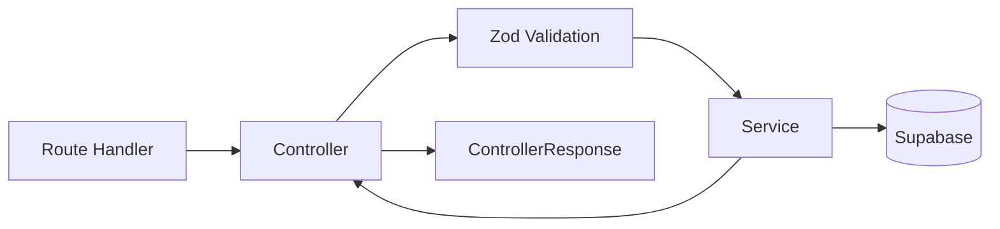

# API

## Overview

The API follows a controller/service architecture. Route handlers in Next.js delegate to controllers, which validate input and coordinate services. Services contain business logic and interact with the database.

## API Structure

All API endpoints are under `/api/v1/`:

```
src/app/(backend)/api/v1/
  admin/          # System admin endpoints
  auth/           # Authentication (login, register, password)
  flashcard-practice/
  flashcard-spaces/
  flashcard-topics/
  flashcards/
  health/         # Health check
  questions/
  quiz-attempts/
  quizzes/
  stats/          # Teacher and student statistics
  subjects/
  university/     # Invitations, members
```

## Request Flow



## Controllers

**Location:** `src/server/controllers/`

Controllers handle:
- Parsing request bodies
- Validating input with Zod schemas
- Calling appropriate service methods
- Returning standardized `ControllerResponse` objects

```typescript
class QuestionController {
  async create(body: unknown, userId: string): Promise<ControllerResponse> {
    const parsed = CreateQuestionSchema.safeParse(body);
    if (!parsed.success) {
      return { success: false, statusCode: 422, error: 'UNPROCESSABLE_ENTITY', details: parsed.error.issues };
    }
    const question = await questionService.create(parsed.data, userId);
    return { success: true, statusCode: 201, data: question };
  }
}
```

## Services

**Location:** `src/server/services/`

Services handle:
- Database queries via Supabase client
- Business logic
- Error throwing via `AppError`

```typescript
class QuestionService {
  async create(data: CreateQuestionInput, userId: string) {
    const supabase = await createClient();
    const { data: question, error } = await supabase
      .from('questions')
      .insert({ ...data, created_by: userId })
      .select()
      .single();
    if (error) throw new AppError('INTERNAL_SERVER');
    return question;
  }
}
```

## Validation

Input validation uses Zod schemas defined in `src/server/models/`. Each domain has its own model file:

```typescript
// src/server/models/question.model.ts
export const CreateQuestionSchema = z.object({
  subjectId: z.string().uuid().optional(),
  type: z.enum(['mcq', 'true_false', 'open']),
  content: z.string().min(1),
  difficulty: z.enum(['easy', 'medium', 'hard']).default('medium'),
  answers: z.array(z.object({
    content: z.string().min(1),
    isCorrect: z.boolean(),
    orderIndex: z.number().int().default(0),
  })).min(1),
});
```

## Error Handling

Services throw `AppError` with a code. Controllers catch these and convert them to appropriate HTTP responses:

```typescript
try {
  const result = await service.doSomething();
  return { success: true, statusCode: 200, data: result };
} catch (error) {
  if (error instanceof AppError) {
    return { success: false, statusCode: error.statusCode, error: error.code };
  }
  return { success: false, statusCode: 500, error: 'INTERNAL_SERVER' };
}
```

## API Documentation

Swagger/OpenAPI documentation is available at `/api/docs` when running the development server. API routes include JSDoc `@swagger` annotations that are used to generate the documentation.

## Standard Response Format

All API responses follow this structure:

```typescript
// Success
{ "success": true, "data": { ... } }

// Error
{ "success": false, "error": "ERROR_CODE", "details": [...] }
```
