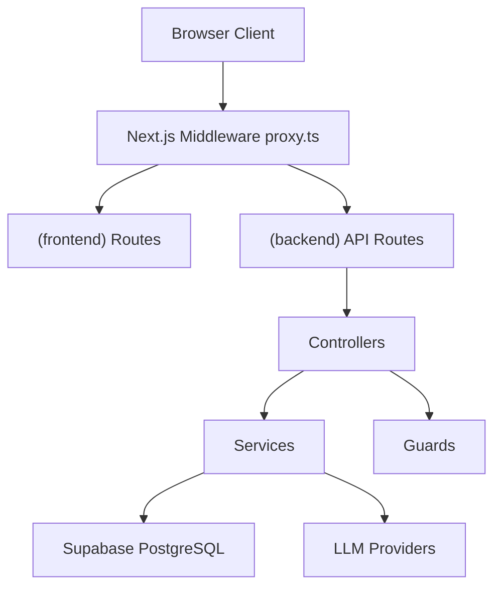
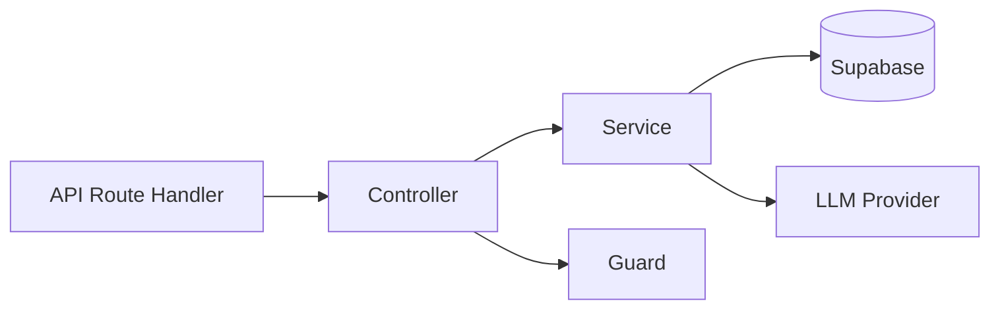
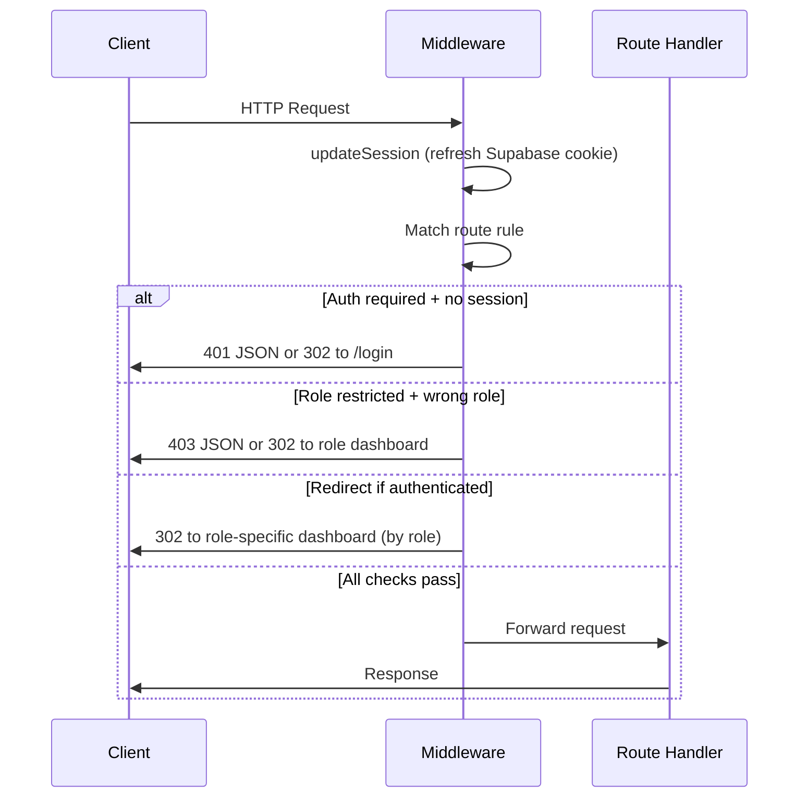
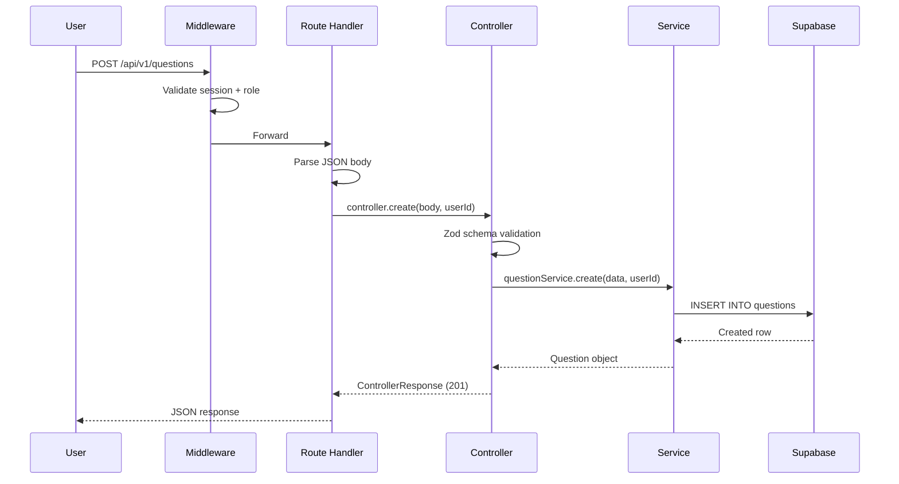

# Architecture

## Overview

StudiQ is a full-stack educational platform built with Next.js App Router and Supabase. The application follows a layered architecture with clear separation between frontend UI, backend business logic, and data access.

## High-Level Architecture



## Application Layers

### Frontend Layer

**Location:** `src/app/(frontend)/`, `src/components/`, `src/hooks/`

**Responsibilities:**
- Rendering UI components
- Client-side navigation
- User interactions
- Localization via `next-intl`
- Theme handling via `next-themes`

**Key components:**
- `src/components/providers/AuthProvider.tsx` — client-side auth state
- `src/components/providers/ThemeProvider.tsx` — dark/light mode
- `src/components/providers/QueryProvider.tsx` — TanStack React Query
- `src/components/ui/` — 60+ shadcn/ui components
- `src/components/layout/` — layout components (navbar, footer, sidebar)
- `src/components/flashcards/` — flashcard-specific UI components
- `src/hooks/` — custom React hooks (API calls, real-time subscriptions, flashcard generation)

### Backend Layer

**Location:** `src/app/(backend)/api/`, `src/server/`

**Responsibilities:**
- HTTP request handling
- Input validation (Zod schemas)
- Business logic execution
- Database communication
- Error handling

**Sub-layers:**



| Layer | Location | Purpose |
|-------|----------|---------|
| Routes | `src/app/(backend)/api/v1/*/route.ts` | Next.js route handlers, parse request, call controller |
| Controllers | `src/server/controllers/` | Validate input via Zod models, coordinate services, return `ControllerResponse` |
| Services | `src/server/services/` | Business logic, database queries via Supabase client |
| Guards | `src/server/guards/` | Authentication and role checks |
| Models | `src/server/models/` | Zod schemas for request validation |
| Providers | `src/server/providers/` | LLM abstraction layer (OpenAI, Ollama) |

### Middleware Layer

**Location:** `src/proxy.ts`

The middleware intercepts every request and applies route rules before the request reaches a handler:



Route rules are defined in `src/server/config/routes.config.ts`:

```typescript
export const routeRules: RouteRule[] = [
  { matcher: /^\/api\/v1\/admin(\/.*)?$/, requireAuth: true, allowedRoles: [UserRole.SYS_ADMIN], isApi: true },
  { matcher: /^\/api\/v1\/teacher(\/.*)?$/, requireAuth: true, allowedRoles: [UserRole.TEACHER, UserRole.SYS_ADMIN], isApi: true },
  { matcher: /^\/admin(\/.*)?$/, requireAuth: true, allowedRoles: [UserRole.SYS_ADMIN] },
  { matcher: /^\/edu(\/.*)?$/, requireAuth: true, allowedRoles: [UserRole.TEACHER] },
  { matcher: /^\/app(\/.*)?$/, requireAuth: true, allowedRoles: [UserRole.STUDENT, UserRole.FREE, UserRole.PREMIUM] },
  // ...
];
```

### Data Layer

**Location:** `supabase/`

Supabase provides:
- PostgreSQL database
- Authentication (email/password, sessions)
- Real-time subscriptions (used for live flashcard updates)

Schema is managed through SQL migration files in `supabase/migrations/`, logical schema files in `supabase/schemas/`, and seed data in `supabase/seeds/`.

## Request Flow



## Error Handling

All errors flow through a unified response system:

- `AppError` — thrown by services with a code and status
- `ControllerResponse` — standardized response shape returned by controllers
- `toNextResponse()` — converts `ControllerResponse` to Next.js `NextResponse`

```typescript
interface ControllerResponse {
  success: boolean;
  statusCode: number;
  data?: unknown;
  error?: string;
  details?: unknown;
}
```

## Key Design Decisions

See [Architecture Decision Records](decisions/) for detailed rationale behind technology and architecture choices.
