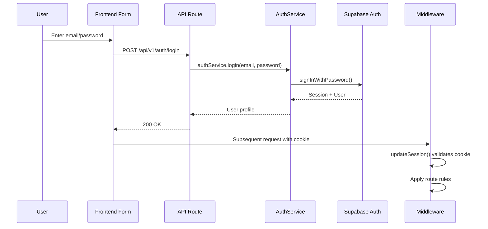
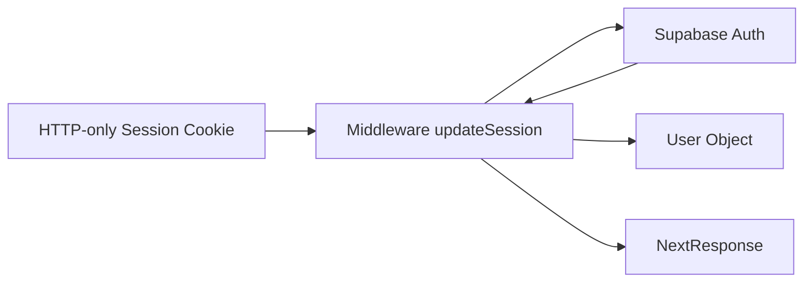
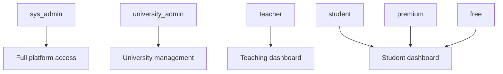

# Authentication

## Overview

Authentication is handled by Supabase Auth with server-side session management through Next.js middleware. Authorization uses a role-based access control (RBAC) system enforced at the middleware and route handler levels.

## Auth Flow



## Session Management

Sessions are managed through HTTP-only cookies set by Supabase. The middleware (`src/proxy.ts`) refreshes and validates sessions on every request via `updateSession()`.



## Role System

Roles are stored in `app_metadata.role` on the Supabase user object and synced to the `profiles` table.



| Role | Access |
|------|--------|
| `sys_admin` | Full platform access, admin dashboard |
| `university_admin` | University management, invitations, members |
| `teacher` | Teaching dashboard, question/subject management |
| `student` | Student dashboard, quizzes, flashcards |
| `premium` | Student features + premium content |
| `free` | Limited student features |

## Route Protection

Routes are protected through a combination of:

1. **Middleware route rules** (`src/server/config/routes.config.ts`) — first line of defense
2. **Route handler auth checks** — defense in depth on individual endpoints
3. **Service-level ownership checks** — users can only modify their own resources

### Middleware Rules

```typescript
{
  matcher: /^\/api\/v1\/admin(\/.*)?$/,
  requireAuth: true,
  allowedRoles: [UserRole.SYS_ADMIN],
  isApi: true,
}
```

When a rule matches:
- If `requireAuth` is true and no session → 401 (API) or redirect to `/login` (UI)
- If `allowedRoles` is set and user role not in list → 403 (API) or redirect to role dashboard (UI)
- If `redirectIfAuthenticatedByRole` is set and user is logged in → redirect to role-specific URL

### Route Handler Guards

Individual API routes perform additional auth checks:

```typescript
const supabase = await createClient();
const { data: { user } } = await supabase.auth.getUser();

if (!user) {
  return toNextResponse({ success: false, statusCode: 401, error: 'UNAUTHORIZED' });
}
```

Some routes also check roles directly:

```typescript
const { data: profile } = await supabase
  .from('profiles')
  .select('role')
  .eq('id', user.id)
  .single();

if (profile.role !== 'sys_admin') {
  return toNextResponse({ success: false, statusCode: 403, error: 'FORBIDDEN' });
}
```

## Client Auth State

`AuthProvider` (`src/components/providers/AuthProvider.tsx`) exposes client-side auth state:

```typescript
{
  user: User | null;
  session: Session | null;
  isLoading: boolean;
}
```

This prevents SSR hydration mismatches and centralizes auth state for UI components.

## Relevant Files

| File | Purpose |
|------|---------|
| `src/proxy.ts` | Middleware — session refresh, route rules, RBAC |
| `src/server/config/routes.config.ts` | Route rule definitions |
| `src/server/guards/auth.guard.ts` | Auth guard utility |
| `src/server/guards/role.guard.ts` | Role guard utility |
| `src/server/services/auth.service.ts` | Auth business logic |
| `src/server/controllers/auth.controller.ts` | Auth request handling |
| `src/components/providers/AuthProvider.tsx` | Client auth state provider |
| `src/app/(backend)/api/v1/auth/*/route.ts` | Auth API endpoints |
