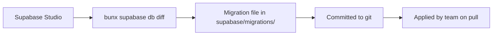

# Database

## Overview

The database is a PostgreSQL 17 instance managed by Supabase. Schema changes are versioned through SQL migration files, logical schema files are organized by domain in `supabase/schemas/`, and seed data lives in `supabase/seeds/`.

## Migration Workflow



### Creating Migrations

After modifying tables in Supabase Studio:

```bash
bunx supabase db diff -f migration_name
```

This generates a SQL file in `supabase/migrations/` with the schema diff.

### Applying Migrations

Migrations are applied automatically when running `bunx supabase start` after a `git pull`.

### Resetting Database

```bash
bunx supabase db reset
```

This drops and recreates the database, applying all migrations and loading seed data.

## Schema Organization

Migrations are timestamped SQL files containing incremental DDL changes. In addition, `supabase/schemas/` contains logically-organized schema files by domain:

```
supabase/
├── migrations/              # Incremental, ordered by timestamp
│   ├── 20260601064040_mig.sql
│   ├── 20260601105712_univ_id_questions.sql
│   ├── 20260601114203_error_logs.sql
│   ├── 20260603060842_flashcards_sm2.sql
│   ├── 20260608063709_spaces-to-decks-rename.sql
│   ├── 20260609065731_rbac_updated.sql
│   ├── 20260610053450_orphan_flashcards_cleanup_function.sql
│   └── z_realtime.sql
└── schemas/                 # Logical groupings
    ├── 00_enums.sql
    ├── 03_universities.sql
    ├── 04_profiles.sql
    ├── 07_invitations.sql
    ├── 09_university_subscriptions.sql
    ├── 12_user_subscriptions.sql
    ├── 21_subjects.sql
    ├── 24_questions.sql
    ├── 27_question_answers.sql
    ├── 30_flashcards.sql
    ├── 31_flashcard_topics.sql
    ├── 32_flashcard_topic_assignments.sql
    ├── 34_flashcard_decks.sql
    ├── 35_flashcard_deck_assignments.sql
    ├── 36_orphan_flashcards_cleanup.sql
    ├── 39_quiz_attempts.sql
    ├── 40_quiz_attempt_questions.sql
    ├── 42_quiz_answers.sql
    ├── 45_flashcard_practice.sql
    ├── 46_flashcard_review_state.sql
    ├── 48_func_update_updated_at.sql
    ├── 51_quiz_refactor.sql
    ├── 54_error_logs.sql
    ├── 55_rbac_permissions.sql
    └── 99_realtime.sql
```

## Seed Data

Seed files are located in `supabase/seeds/` and are organized by domain:

| File | Purpose |
|------|---------|
| `01_users.sql` | Auth users, identities, profile roles |
| `02_subjects.sql` | Sample subjects |
| `03_questions.sql` | Sample questions |
| `04_question_answers.sql` | Question answers |
| `05_flashcards.sql` | Sample flashcards |
| `06_flashcard_topics.sql` | Flashcard topics |
| `06_quiz_attempts.sql` | Quiz attempts |
| `07_flashcard_decks.sql` | Flashcard decks |
| `08_flashcard_practice.sql` | Practice history |
| `09_perms.sql` | RBAC permissions |

## Table Domains

### Users & Profiles

| Table | Description |
|-------|-------------|
| `profiles` | User profiles with role, university_id, and metadata |
| `universities` | University organizations |
| `university_members` | University membership records |
| `invitations` | Token-based invitation system |
| `university_subscriptions` | University subscription plans |
| `user_subscriptions` | Individual user subscriptions |

### Learning System

| Table | Description |
|-------|-------------|
| `subjects` | Course subjects owned by users |
| `questions` | Questions with type, difficulty, and content |
| `question_answers` | Multiple choice answers for questions |
| `flashcards` | Flashcard content (front/back) |
| `flashcard_topics` | Topic groupings for flashcards |
| `flashcard_decks` | User-defined flashcard collections |
| `flashcard_topic_assignments` | Flashcard-to-topic relationships |
| `flashcard_deck_assignments` | Flashcard-to-deck relationships |

### Quiz System

| Table | Description |
|-------|-------------|
| `quiz_attempts` | User quiz sessions |
| `quiz_attempt_questions` | Questions within a quiz attempt |
| `quiz_answers` | User's selected answers with correctness |

### Practice Tracking

| Table | Description |
|-------|-------------|
| `flashcard_practice` | Flashcard practice history with correctness tracking |
| `flashcard_review_state` | SM-2 spaced repetition state per flashcard |

### RBAC (Role-Based Access Control)

| Table | Description |
|-------|-------------|
| `permissions` | Static list of permission names (e.g. `flashcard.read`) |
| `role_permissions` | Maps roles to permissions with scopes (`own`, `university`, `any`) |

### Admin

| Table | Description |
|-------|-------------|
| `error_logs` | Application error logging for sys_admin review |

## Database Access

The application accesses the database through the Supabase client:

- **Server-side:** `@/lib/supabase/server` — uses SSR cookies for user context
- **Client-side:** `@/lib/supabase/client` — uses browser session
- **Service role:** `@/lib/supabase/service` — admin-level access for server-only operations
- **Tests:** `createRealClient()` — uses anon key for direct access
