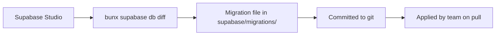

# Database

## Overview

The database is a PostgreSQL instance managed by Supabase. Schema changes are versioned through SQL migration files and seed data is organized by domain.

## Migration Workflow



### Creating Migrations

After modifying tables in Supabase Studio:

```bash
bunx supabase db diff -f migration_name
```

This generates a SQL file in `supabase/migrations/` with the schema diff.

### Applying Migrations

Migrations are applied automatically when running `bunx supabase start` after a `git pull`.

### Resetting Database

```bash
bunx supabase db reset
```

This drops and recreates the database, applying all migrations and loading seed data.

## Seed Data

Seed files are located in `supabase/seeds/` and are organized by domain:

| File | Purpose |
|------|---------|
| `01_users.sql` | Auth users, identities, profile roles |
| `02_subjects.sql` | Sample subjects |
| `03_questions.sql` | Sample questions |
| `04_question_answers.sql` | Question answers |
| `05_flashcards.sql` | Sample flashcards |
| `06_flashcard_topics.sql` | Flashcard topics |
| `06_quiz_attempts.sql` | Quiz attempts |
| `07_flashcard_spaces.sql` | Flashcard spaces |
| `08_flashcard_practice.sql` | Practice history |

## Table Domains

### Users & Profiles

| Table | Description |
|-------|-------------|
| `profiles` | User profiles with role, university_id, and metadata |
| `universities` | University organizations |
| `invitations` | Token-based invitation system |

### Learning System

| Table | Description |
|-------|-------------|
| `subjects` | Course subjects owned by users |
| `questions` | Questions with type, difficulty, and content |
| `question_answers` | Multiple choice answers for questions |
| `flashcards` | Flashcard content (front/back) |
| `flashcard_topics` | Topic groupings for flashcards |
| `flashcard_spaces` | User-defined flashcard collections |
| `flashcard_topic_assignments` | Flashcard-to-topic relationships |
| `flashcard_space_assignments` | Flashcard-to-space relationships |

### Quiz System

| Table | Description |
|-------|-------------|
| `quiz_attempts` | User quiz sessions |
| `quiz_attempt_questions` | Questions within a quiz attempt |
| `quiz_answers` | User's selected answers with correctness |

### Practice Tracking

| Table | Description |
|-------|-------------|
| `flashcard_practice` | Flashcard practice history with correctness tracking |

### RBAC (Role-Based Access Control)

| Table | Description |
|-------|-------------|
| `permissions` | Static list of permission names (e.g. `flashcard.read`) |
| `role_permissions` | Maps roles to permissions with scopes (`own`, `university`, `any`) |
| `resource_permissions` | FUTURE: explicit per-resource grants for deck/topic sharing |

### University Management

| Table | Description |
|-------|-------------|
| `university_members` | University membership records |

## Schema Organization

Migrations are numbered chronologically. Each migration file contains DDL statements for one or more related changes:

```
supabase/migrations/
  20260512142747_mig.sql      # Initial schema
  20260512182205_mig2.sql     # Subsequent changes
```

## Database Access

The application accesses the database through the Supabase client:

- **Server-side:** `@/lib/supabase/server` — uses SSR cookies for user context
- **Client-side:** `@/lib/supabase/client` — uses browser session
- **Tests:** `createRealClient()` — uses anon key for direct access
